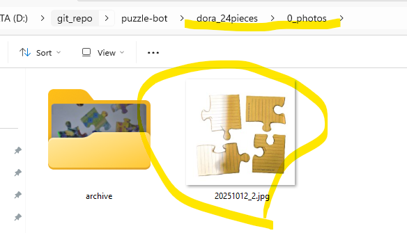
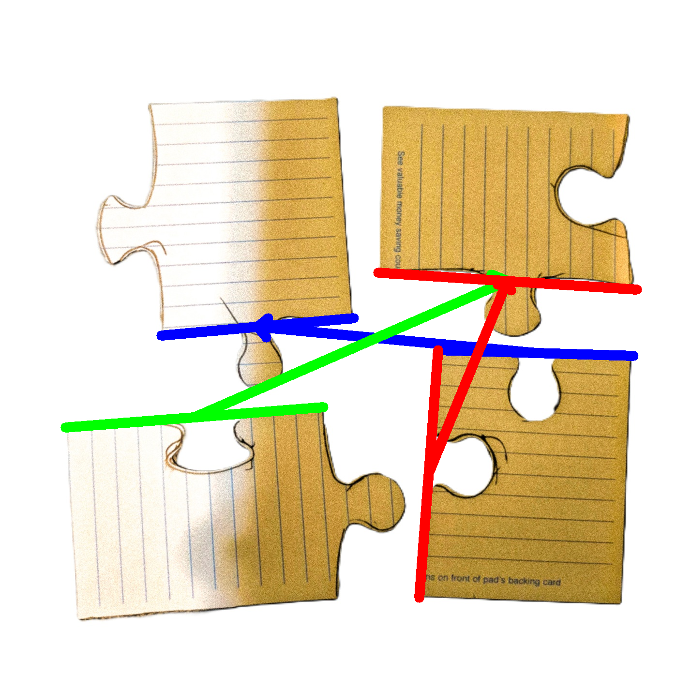

# puzzle-bot

The code that powers a jigsaw puzzle solving robot. This reliably solves a few 1000-piece all-white puzzles. I'm making this somewhat easier on myself by assuming the puzzle pieces come to form a grid, where each piece has four sides.

## Watch the Results

I made a Youtube video with Mark Rober [here](https://www.youtube.com/watch?v=Sqr-PdVYhY4).

## Full Technical Writeup

[Fourty-four pages of detail can be found here](https://docs.google.com/document/d/1BUCGdZCe8JevGYF3pJ4ZjPqpcSgA7LF0kV6sWbHrT1Q/).

## How to Run

This project can be run from the command line. The main entrypoint is `src/run_batch.py`. It takes a `--path` argument that should point to a directory with a subdirectory named `0_photos` that contains the input images.

An example is provided in the `example_data` directory. To run the project with the example data, use the following command from the root of the repository:

```bash
python src/run_batch.py --path example_data
python src/run_batch.py --path example_data --start-at-step 5
python src/run_batch.py --path example_data --only-process-id 20240603_172601
python src/run_batch.py --path example_data --start-at-step 5
python src/run_batch.py --path example_data --stop-before-step 3
```
```markdown
--path: Path to the base directory containing a `0_photos` folder with JPEGs. Type: str
--only-process-id: Only process the specified ID. Default: None, Required: False, Type: str
--start-at-step: Start processing at this step. Default: 0, Required: False, Type: int
--stop-before-step: Stop processing at this step. Default: 10, Required: False, Type: int
--serialize: Enable single-threaded processing. Default: False, Action: store_true
```

## Puzzle Solving Overview

1.  add one image on o_photos directory under path provided to run_batch.py
    if run like this, 
    python.exe D:\git_repo\puzzle-bot\src\run_batch.py --path dora_24pieces
    load photo on   dora_24pieces\0_photos\  as  img_001.jpg  jpg only for now
   
   
2. Process each photo 
    1. Crop the photo by a configurable amount. This allows for faster processing as it is preferable to have photos with pieces closest to the center
    2. Segment the photo into a binary bitmap: 0s are the black background and 1s are pieces (or dust)
    3. Extract each piece from the photo by finding large connected islands of 1s
    4. Clean the extracted piece by removing fine details like dust and hairs
    5. Save off the piece as a binary bitmap

3. Process each piece
    1. Find the edge of the piece in the binary image
    2. Walk along the edge, creating a dense vector path
    3. Detect the four corners of the piece with an algorithm that finds the best four candidates based on a handful of heuristics
    4. "Enhance" the corners by finding where the two sides would intersect, to account for slightly dinged or rounded-off corners
    5. Extract the four sides by yanking all vertices between two consecutive corners
    6. Note which sides are edges by calculating how close to perfectly straight each side is
    7. Compute the best point inside the piece for the robot to grip the piece from, by computing an approximate incenter - the point inside a polygon furthest from the nearest side
    8. Save off the piece's data and metadata about its sides, position in the input photo, etc.

4. Deduplicate pieces that were seen in multiple images
    1. We use the vector data because our test puzzles had printed patterns on them useful for debugging
    2. Compare each piece to every other piece
    3. Eliminate pieces that were taken far enough away in gripper-space
    4. If two pieces were geographically proximal, we compare how similar their four sides are
    5. We only keep one of each duplicate found, and we select the one closest to the center of its photo, to minimize parallax

5. Find all other pieces each piece can feasibly connect with
    1. For each side in each piece, compare the geometric fit to all other pieces' sides
    
        1. _ASCII art showing the solver comparing two sides (green and yellow) and their proximity (white=intersection):_
    2. Save off a list of the most likely fits for each side, sorted by their geometric similarity
        1. Note: small improvements to this part of the algorithm have an outsized impace on solve times. This is because the current solver's runtime complexity blows up quickly as the connectivity of the graph (i.e. how many sides could match) gets denser

6. suggests best matchings for each piece side
    
    

## Results


# puzzle-bot
